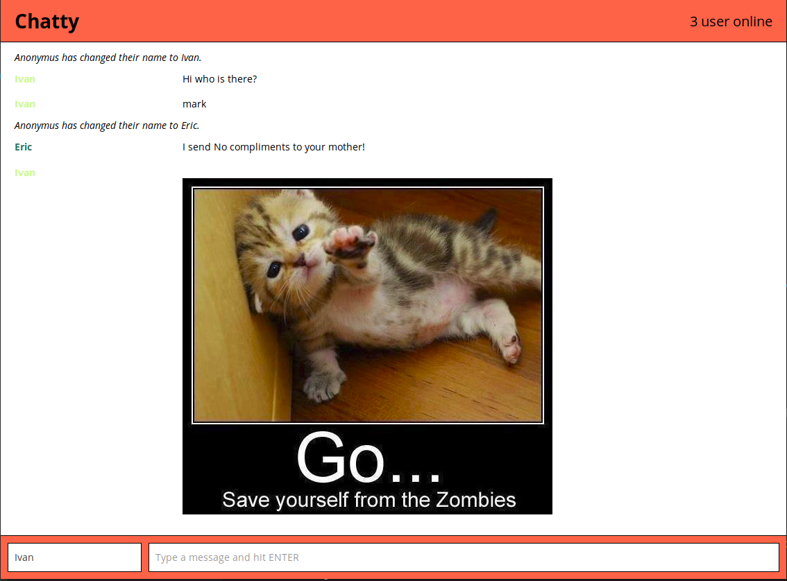

# Chatty App - Client 

A simple chatroom client.
Link to the chat server repository : https://github.com/venetrius/chatty_server



## Getting started:
```
//first install & start chat-server ==> https://github.com/venetrius/chatty_server
npm install
npm start
open http://localhost:3000
```

### Dependencies

* React
* Webpack
* [babel-loader](https://github.com/babel/babel-loader)
* [webpack-dev-server](https://github.com/webpack/webpack-dev-server)
